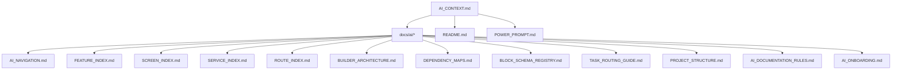

# LandyMaker Documentation Ownership Map

> Purpose: Define ownership, responsibilities, and relationships for every major documentation asset.
> Last Updated: 2026-06-12

---

## 1. Primary Sources of Truth

| Document | Purpose | Scope | Owner Domain | Status |
|----------|---------|-------|--------------|--------|
| **AI_CONTEXT.md** | Project constitution — architecture, rules, deployment, AI guidance | Full project | Architect | ✅ Source of Truth |
| **middleware.js** | Edge routing, SEO, bot detection | SEO, Routing, Blog proxy | DevOps/SEO | ✅ Source of Truth |
| **pubspec.yaml** | Flutter dependencies, assets, build config | Frontend dependencies | Flutter Engineer | ✅ Source of Truth |
| **vercel.json** | Vercel routing and build config | Deployment | DevOps | ✅ Source of Truth |
| **package.json** | Root Node config | Vercel API/Middleware | DevOps | ✅ Source of Truth |

---

## 2. AI Documentation (docs/ai/)

| Document | Purpose | Related Docs | Source of Truth Status |
|----------|---------|--------------|----------------------|
| **AI_NAVIGATION.md** | Fast file location for AI models | AI_CONTEXT.md, PROJECT_STRUCTURE.md | ✅ Current |
| **AI_ONBOARDING.md** | Entry-point guide for new AI models | AI_NAVIGATION.md, TASK_ROUTING_GUIDE.md | ✅ Current |
| **AI_DOCUMENTATION_RULES.md** | Rules for keeping docs synchronized | All docs/ai/ files | ✅ Current |
| **PROJECT_STRUCTURE.md** | Folder hierarchy and architecture boundaries | AI_CONTEXT.md, FEATURE_INDEX.md | ✅ Current |
| **FEATURE_INDEX.md** | Feature-to-file mapping | SCREEN_INDEX.md, SERVICE_INDEX.md | ✅ Current |
| **SCREEN_INDEX.md** | Screen-to-file-and-route mapping | ROUTE_INDEX.md, FEATURE_INDEX.md | ✅ Current |
| **SERVICE_INDEX.md** | Global service directory with dependencies | injection_container.dart | ✅ Current |
| **ROUTE_INDEX.md** | Route definitions with guards | SCREEN_INDEX.md, app_router.dart | ✅ Current |
| **BUILDER_ARCHITECTURE.md** | Builder system data flow | BLOCK_SCHEMA_REGISTRY.md, AI_NAVIGATION.md | ✅ Current |
| **DEPENDENCY_MAPS.md** | System relationship diagrams | SERVICE_INDEX.md, BUILDER_ARCHITECTURE.md | ✅ Current |
| **BLOCK_SCHEMA_REGISTRY.md** | JSON schema for AI-agent editing | BUILDER_ARCHITECTURE.md, block_registry.dart | ✅ Current |
| **TASK_ROUTING_GUIDE.md** | Workflow-specific doc routing | AI_ONBOARDING.md, AI_NAVIGATION.md | ✅ Current |
| **MISSION_EXECUTION.md** (archived) | Growth & AI mission tracker (historical) | AI_CONTEXT.md Section 16 | 📜 Archived |
| **SECURITY_AUDIT_REPORT.md** (archived) | Security audit for Growth mission (historical) | MISSION_EXECUTION.md | 📜 Archived |
| **FINAL_MISSION_REPORT.md** (archived) | Final mission summary (historical) | MISSION_EXECUTION.md | 📜 Archived |
| **AI_AGENT_REPORT.md** (archived) | AI agent optimization report (historical) | AI_AGENT_CONTINUATION_PROMPT.md | 📜 Archived |
| **AI_AGENT_CONTINUATION_PROMPT.md** (archived) | Continuation prompt for AI models | AI_CONTEXT.md | 📜 Archived |
| **GUEST_FLOW_GUIDE.md** (archived) | Guest AI generation flow | AI_CONTEXT.md Section 16 | 📜 Archived |
| **interactive_ai_agent_analysis.md** (archived) | Analysis for conversational AI (historical) | interactive_ai_agent_architecture.md | 📜 Archived |
| **interactive_ai_agent_architecture.md** (archived) | Architecture for conversational AI (historical) | interactive_ai_agent_final_report.md | 📜 Archived |
| **interactive_ai_agent_final_report.md** (archived) | Final report on conversational AI (historical) | interactive_ai_agent_analysis.md | 📜 Archived |

**Legend:**
- ✅ Current = Actively maintained source of truth
- 📜 Archived = Historical report, moved to `docs/archive/` for reference
- 🔄 Overlaps = Partially duplicated in another source

---

## 3. Root Documentation

| Document | Purpose | Owner Domain | Status |
|----------|---------|--------------|--------|
| **README.md** | Public-facing project overview, getting started | Product | ✅ Current |
| **POWER_PROMPT.md** | Full execution protocol for AI assistants | AI/Architect | ✅ Current |
| ~~POWER_PROMPT_LITE.md~~ | ~~Shortened version of POWER_PROMPT.md~~ (removed, consolidated into POWER_PROMPT.md) | AI/Architect | ❌ Removed |
| **API_LOGGING_GUIDE.md** | Logging system reference | Backend Engineer | ✅ Current |
| **ROADMAP-EN.md** | Development roadmap (all tasks completed) | Product | 📜 Historical |
| **GAPS_AND_VULNERABILITIES.md** | E-commerce and platform gap analysis | Product | 🔄 Partially updated |
| **maintainability_audit.md** | Repository audit report | Architect | ✅ Current (NEW) |
| **DOCUMENTATION_OWNERSHIP_MAP.md** | This document | Architect | ✅ Current (NEW) |

---

## 4. Sub-project Documentation

| Document | Purpose | Owner Domain | Status |
|----------|---------|--------------|--------|
| **lib/features/README.md** | Feature module overview | Flutter Engineer | ✅ Current |
| **lib/core/README.md** | Core module overview | Flutter Engineer | ✅ Current |
| **lib/services/README.md** | Global services overview | Flutter Engineer | ✅ Current |
| **supabase/README.md** | Supabase backend overview | Backend Engineer | ✅ Current |
| **blog-frontend/README.md** | Blog frontend (Next.js headless blog for LandyMaker) | Frontend Engineer | ✅ Current |
| **blog-frontend/AGENTS.md** | Next.js agent rules | AI/Frontend | ✅ Current |
| **blog-frontend/CLAUDE.md** | Claude rules reference | AI/Frontend | ✅ Current |

---

## 5. Archive (`docs/archive/`)

| Document | Original Location | Status |
|----------|-------------------|--------|
| MISSION_EXECUTION.md | docs/ai/ | 📜 Archived (all tasks completed) |
| SECURITY_AUDIT_REPORT.md | docs/ai/ | 📜 Archived (historical audit) |
| FINAL_MISSION_REPORT.md | docs/ai/ | 📜 Archived (historical report) |
| AI_AGENT_REPORT.md | docs/ai/ | 📜 Archived (historical report) |
| AI_AGENT_CONTINUATION_PROMPT.md | docs/ai/ | 📜 Archived (historical prompt) |
| GUEST_FLOW_GUIDE.md | docs/ai/ | 📜 Archived (info covered in AI_CONTEXT.md) |
| interactive_ai_agent_analysis.md | docs/ai/ | 📜 Archived (historical analysis) |
| interactive_ai_agent_architecture.md | docs/ai/ | 📜 Archived (historical architecture) |
| interactive_ai_agent_final_report.md | docs/ai/ | 📜 Archived (historical report) |

---

## 6. Architectural Boundaries

---

## 7. Update Responsibilities

| When This Changes | Update These Docs |
|-------------------|-------------------|
| New feature/screen added | FEATURE_INDEX.md, SCREEN_INDEX.md, ROUTE_INDEX.md, AI_CONTEXT.md |
| New route added | ROUTE_INDEX.md, AI_CONTEXT.md (reserved paths) |
| New service added | SERVICE_INDEX.md, DEPENDENCY_MAPS.md, injection_container.dart |
| Builder section added | BUILDER_ARCHITECTURE.md, BLOCK_SCHEMA_REGISTRY.md, AI_CONTEXT.md |
| Folder structure changes | PROJECT_STRUCTURE.md, AI_CONTEXT.md |
| Environment variables change | AI_CONTEXT.md (Section 15.4), deploy.yml |
| Dependencies change | pubspec.yaml, PROJECT_STRUCTURE.md |
