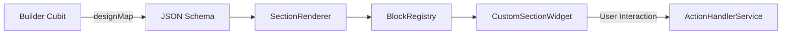

# Builder Architecture - LandyMaker

The LandyMaker Builder is a sophisticated, reactive system for visual web creation. It follows a strict "Source of Truth" pattern using JSON.

## 🧬 Sharded Cubit Architecture (Mixin Pattern)

`LandingPageBuilderCubit` (207 lines) is the central state manager, but its methods are split across two mixin part files to keep each file under the AI-friendly 800-line limit:

| File | Lines | Role |
|------|-------|------|
| `builder_cubit.dart` | 207 | Main class: fields, constructor, `_history`/`_historyIndex` for undo/redo, `_emitDirty`, `_saveToHistory`, `close()` |
| `builder_cubit_blocks.dart` | 1057 | `BuilderCubitBlocks` mixin — 26 block CRUD methods: `addBlock()`, `removeBlock()`, `duplicateBlock()`, `moveBlock()`, `updateBlockProperty()`, etc. |
| `builder_cubit_persistence.dart` | 1025 | `BuilderCubitPersistence` mixin — 18 persistence & page management methods: `loadPage()`, `savePage()`, `_saveGuestDesign()`, `_handleLoadedPage()`, `importTemplateAssets()`, etc. |

**How it works**: The main class `LandingPageBuilderCubit extends Cubit<BuilderState> with BuilderCubitBlocks, BuilderCubitPersistence`. Each mixin declares abstract members for private fields it needs (e.g., `_authService`, `_databaseService`, `_emitDirty()`) which are satisfied by the main cubit. This preserves private member access without exposing internals to the public API.

### SupabaseService Parallel Split

`SupabaseService` follows the same pattern — a `ChangeNotifier` with 3 mixin part files:

| File | Lines | Role |
|------|-------|------|
| `supabase_service.dart` | 450 | Singleton, fields/getters, `initialize()`, super-admin ops, templates, homepage sections, platform SEO, notifications, bulk ops |
| `supabase/supabase_auth.dart` | 108 | `SupabaseServiceAuth` mixin — `register`, `login`, `logout`, `sendPasswordResetEmail`, `signInWithGoogle` |
| `supabase/supabase_pages.dart` | 306 | `SupabaseServicePages` mixin — landing page CRUD, leads submission, analytics events |
| `supabase/supabase_storage.dart` | 166 | `SupabaseServiceStorage` mixin — image upload with quota enforcement, list, delete, asset registration |

## 🔄 Core Data Flow



### 1. The Source of Truth (`designMap`)
Every visual element on the canvas is represented by a JSON dictionary stored in `LandingPageBuilderCubit`. 
- **Structure**: `{"blocks": [{"type": "hero", "title": "Hello", ...}, ...]}`
- **Persistence**: Auto-saved to Supabase `landing_pages` table under `design_json`.

### 2. Registry Mapping (`BlockRegistry`)
Located in `lib/features/builder/registries/block_registry.dart`.
- Acts as a factory that maps a `type` string (from JSON) to a Flutter `Widget`.
- **Constraint**: To add a new section, you **must** register it here.

### 3. Property Editing (`*Editor`)
When a user selects a block on the canvas:
1. `BuilderSidebar` identifies the selected block type.
2. It instantiates the corresponding editor from `lib/features/builder/widgets/editors/blocks/`.
3. Editor widgets communicate changes back to the `LandingPageBuilderCubit`.

### 4. Theme Management (`BuilderThemeCubit`)
Global design properties (colors, fonts, backgrounds) are managed by a **separate** cubit:
- **`BuilderThemeCubit`** (in `lib/features/builder/controllers/builder_theme_cubit.dart`) owns the `LandingPageTheme` state.
- It exposes `updateTheme()`, `updateThemeProperty()`, and `replaceTheme()`.
- `LandingPageBuilderCubit` subscribes to `BuilderThemeCubit.stream` via a listener that syncs the theme back into `BuilderLoaded.theme` — keeping the 40+ existing widgets that read `state.theme` unchanged.
- Theme changes are included in the undo/redo history via a `_suppressHistoryFromTheme` flag that prevents double-recording.

### 5. AI Theme Application Flow
When the AI edits a page (`AIGenerationCubit.processUserMessage`), the theme is applied via `applyDesignJson`:
1. `AIGenerationCubit` validates the AI response via `AIResponseValidator` (hex prefix correction, schema validation).
2. Validated design is passed to `LandingPageBuilderCubit.applyDesignJson()` in `builder_cubit_persistence.dart`.
3. `applyDesignJson()` reads `designJson['theme'] ?? designJson['global_theme']` to extract the theme object.
4. A `LandingPageTheme` is created via `LandingPageTheme.fromJson()` and applied via `_themeCubit.replaceTheme()`.
5. The `_suppressHistoryFromTheme` flag prevents the theme subscription callback from double-recording into history.
6. Blocks are replaced entirely: `_emitDirty(copyWith(designMap: newDesign))`.
7. `DynamicFontService.loadFontsFromDesign()` is called to load the theme's `defaultFont` before the canvas rebuilds.
8. Theme is synced into `BuilderLoaded.theme` via the existing `BuilderThemeCubit.stream` subscription.

## 🛠 Advanced Features

### 🕒 Undo / Redo
- The `LandingPageBuilderCubit` maintains a `List<String> _history`.
- Every state change is serialized and added to history (max 50 steps).
- Simple pointer-based logic (`_historyIndex`) allows forward and backward travel.

### 💾 Auto-Save Logic
- The Builder uses a **Dirty Flag** system.
- Changes trigger a debounced save operation to Supabase via `DatabaseService.saveLandingPage`.
- The `hasUnsavedChanges` flag informs the user of the sync status.

### 🏗 Templates
- `TemplateRegistry` provides static JSON starting points for different industries.
- When a user picks a template, the `designMap` is initialized with the template's JSON array.
- Template metadata includes `category`, `recommendedSections`, and `aiPromptHint` to help future AI-assisted flows pick a suitable starting point without scanning implementation files.
- Template block JSON may include helper-only keys such as `ai_intent` and `ai_slots`; these are advisory and must not become required renderer fields.

### 🧩 Section Library
- `SectionLibraryModal` is the builder-facing catalog of addable section types.
- Each catalog entry should map to an existing `BlockRegistry` type and include a concise category plus optional `ai_role` / `ai_when_to_use` guidance.
- Do not expose a section in the library unless `LandingPageBuilderCubit.addBlock`, `BlockRegistry`, and an editor path can handle it.
- **Dual Preview**: Each library card renders a `_DualMiniPreview` showing mobile (35% width) and desktop (65% width) side-by-side, with a colored accent border on the mobile side for visual distinction. The card uses `childAspectRatio` of `0.62` on small screens and `0.70` on larger ones. Title uses `AppTypography.h3` with no subtitle.
- **Style Registry**: `lib/features/builder/registries/style_registry.dart` is **deprecated** (dead code since Phase 11). Do not import or restore it. The `SectionVariant` class and `StyleRegistry.variants` list were removed from the UI — only the layout picker (`LayoutPickerPanel`) remains.

## ⚡ Isolate-Based JSON Serialization

To prevent UI jank from blocking JSON operations, all `jsonEncode` and `jsonDecode` in the builder and viewer pipelines are offloaded to background isolates:

### `jsonEncode` (Save Path)
- **File**: `builder_cubit_persistence.dart`
- **Helper**: Top-level `_serializeDesignMap()` function
- **Usage**: `await Isolate.run(() => _serializeDesignMap(designMap))` in both `savePage()` and `_saveGuestDesign()`
- **Impact**: Eliminates 30–80ms of main-thread blocking on pages with 50+ blocks

### `jsonDecode` (Load/History Path)
- **File**: `lib/core/utils/json_utils.dart`
- **Helper**: `parseJsonDesign(dynamic rawDesign)` — reusable helper that handles String/Map/null inputs
- **Usage**: Called from 6 call sites:
  1. `public_page_cubit.dart` — page load decode (8–50ms saved)
  2. `builder_cubit_persistence.dart` — editor page load decode (15–40ms saved)
  3. `create_page_modal.dart` — template init decode (8–30ms saved)
  4. `landymaker_home_screen.dart` — homepage carousel decode (8–30ms saved)
  5. `builder_cubit.dart` — `undo()`/`redo()` history decode (15–40ms saved)
- **Impact**: Eliminates 40–360ms total UI blocking per interaction cycle

### Pattern
```dart
// Top-level function (required for Isolate.run)
Map<String, dynamic> _decodeDesignJson(String json) =>
    Map<String, dynamic>.from(jsonDecode(json));

// Usage inside cubit/state
final decoded = await Isolate.run(() => _decodeDesignJson(rawJsonString));
```

## 🔍 How Rendering Works
The `SectionRenderer` is a shared component used by both the **Editor** and the **Public Viewer**.
- **Editor Mode**: Wraps sections in `SectionToolbarOverlay` to show selection borders and edit handles.
- **Public Mode**: Renders raw sections with maximum performance.
