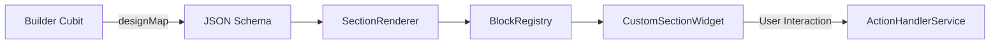

# Builder Architecture - LandyMaker

The LandyMaker Builder is a sophisticated, reactive system for visual web creation. It follows a strict "Source of Truth" pattern using JSON.

## 🔄 Core Data Flow

### 1. The Source of Truth (`designMap`)
Every visual element on the canvas is represented by a JSON dictionary stored in `LandingPageBuilderCubit`. 
- **Structure**: `{"blocks": [{"type": "hero", "title": "Hello", ...}, ...]}`
- **Persistence**: Auto-saved to Supabase `landing_pages` table under `design_json`.

### 2. Registry Mapping (`BlockRegistry`)
Located in `lib/features/builder/registries/block_registry.dart`.
- Acts as a factory that maps a `type` string (from JSON) to a Flutter `Widget`.
- **Constraint**: To add a new section, you **must** register it here.

### 3. Property Editing (`*Editor`)
When a user selects a block on the canvas:
1. `BuilderSidebar` identifies the selected block type.
2. It instantiates the corresponding editor from `lib/features/builder/widgets/editors/blocks/`.
3. Editor widgets communicate changes back to the `LandingPageBuilderCubit`.

### 4. Theme Management (`BuilderThemeCubit`)
Global design properties (colors, fonts, backgrounds) are managed by a **separate** cubit:
- **`BuilderThemeCubit`** (in `lib/features/builder/controllers/builder_theme_cubit.dart`) owns the `LandingPageTheme` state.
- It exposes `updateTheme()`, `updateThemeProperty()`, and `replaceTheme()`.
- `LandingPageBuilderCubit` subscribes to `BuilderThemeCubit.stream` via a listener that syncs the theme back into `BuilderLoaded.theme` — keeping the 40+ existing widgets that read `state.theme` unchanged.
- Theme changes are included in the undo/redo history via a `_suppressHistoryFromTheme` flag that prevents double-recording.

## 🛠 Advanced Features

### 🕒 Undo / Redo
- The `LandingPageBuilderCubit` maintains a `List<String> _history`.
- Every state change is serialized and added to history (max 50 steps).
- Simple pointer-based logic (`_historyIndex`) allows forward and backward travel.

### 💾 Auto-Save Logic
- The Builder uses a **Dirty Flag** system.
- Changes trigger a debounced save operation to Supabase via `DatabaseService.saveLandingPage`.
- The `hasUnsavedChanges` flag informs the user of the sync status.

### 🏗 Templates
- `TemplateRegistry` provides static JSON starting points for different industries.
- When a user picks a template, the `designMap` is initialized with the template's JSON array.
- Template metadata includes `category`, `recommendedSections`, and `aiPromptHint` to help future AI-assisted flows pick a suitable starting point without scanning implementation files.
- Template block JSON may include helper-only keys such as `ai_intent` and `ai_slots`; these are advisory and must not become required renderer fields.

### 🧩 Section Library
- `SectionLibraryModal` is the builder-facing catalog of addable section types.
- Each catalog entry should map to an existing `BlockRegistry` type and include a concise category plus optional `ai_role` / `ai_when_to_use` guidance.
- Do not expose a section in the library unless `LandingPageBuilderCubit.addBlock`, `BlockRegistry`, and an editor path can handle it.

## 🔍 How Rendering Works
The `SectionRenderer` is a shared component used by both the **Editor** and the **Public Viewer**.
- **Editor Mode**: Wraps sections in `SectionToolbarOverlay` to show selection borders and edit handles.
- **Public Mode**: Renders raw sections with maximum performance.
