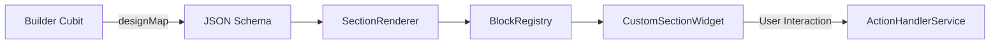

# Builder Architecture - LandyMaker

The LandyMaker Builder is a sophisticated, reactive system for visual web creation. It follows a strict "Source of Truth" pattern using JSON.

## 🧬 Sharded Cubit Architecture (Mixin Pattern)

`LandingPageBuilderCubit` (207 lines) is the central state manager, but its methods are split across two mixin part files to keep each file under the AI-friendly 800-line limit:

| File | Lines | Role |
|------|-------|------|
| `builder_cubit.dart` | 207 | Main class: fields, constructor, `_history`/`_historyIndex` for undo/redo, `_emitDirty`, `_saveToHistory`, `close()` |
| `builder_cubit_blocks.dart` | 1057 | `BuilderCubitBlocks` mixin — 26 block CRUD methods: `addBlock()`, `removeBlock()`, `duplicateBlock()`, `moveBlock()`, `updateBlockProperty()`, etc. |
| `builder_cubit_persistence.dart` | 1025 | `BuilderCubitPersistence` mixin — 18 persistence & page management methods: `loadPage()`, `savePage()`, `_saveGuestDesign()`, `_handleLoadedPage()`, `importTemplateAssets()`, etc. |

**How it works**: The main class `LandingPageBuilderCubit extends Cubit<BuilderState> with BuilderCubitBlocks, BuilderCubitPersistence`. Each mixin declares abstract members for private fields it needs (e.g., `_authService`, `_databaseService`, `_emitDirty()`) which are satisfied by the main cubit. This preserves private member access without exposing internals to the public API.

### SupabaseService Parallel Split

`SupabaseService` follows the same pattern — a `ChangeNotifier` with 3 mixin part files:

| File | Lines | Role |
|------|-------|------|
| `supabase_service.dart` | 450 | Singleton, fields/getters, `initialize()`, super-admin ops, templates, homepage sections, platform SEO, notifications, bulk ops |
| `supabase/supabase_auth.dart` | 108 | `SupabaseServiceAuth` mixin — `register`, `login`, `logout`, `sendPasswordResetEmail`, `signInWithGoogle` |
| `supabase/supabase_pages.dart` | 306 | `SupabaseServicePages` mixin — landing page CRUD, leads submission, analytics events |
| `supabase/supabase_storage.dart` | 166 | `SupabaseServiceStorage` mixin — image upload with quota enforcement, list, delete, asset registration |

## 🔄 Core Data Flow



### 1. The Source of Truth (`designMap`)
Every visual element on the canvas is represented by a JSON dictionary stored in `LandingPageBuilderCubit`. 
- **Structure**: `{"blocks": [{"type": "hero", "title": "Hello", ...}, ...]}`
- **Persistence**: Auto-saved to Supabase `landing_pages` table under `design_json`.

### 2. Registry Mapping (`BlockRegistry`)
Located in `lib/features/builder/registries/block_registry.dart`.
- Acts as a factory that maps a `type` string (from JSON) to a Flutter `Widget`.
- **Constraint**: To add a new section, you **must** register it here.

### 3. Property Editing (`*Editor`)
When a user selects a block on the canvas:
1. `BuilderSidebar` identifies the selected block type.
2. It instantiates the corresponding editor from `lib/features/builder/widgets/editors/blocks/`.
3. Editor widgets communicate changes back to the `LandingPageBuilderCubit`.

### 4. Theme Management (`BuilderThemeCubit`)
Global design properties (colors, fonts, backgrounds) are managed by a **separate** cubit:
- **`BuilderThemeCubit`** (in `lib/features/builder/controllers/builder_theme_cubit.dart`) owns the `LandingPageTheme` state.
- It exposes `updateTheme()`, `updateThemeProperty()`, and `replaceTheme()`.
- `LandingPageBuilderCubit` subscribes to `BuilderThemeCubit.stream` via a listener that syncs the theme back into `BuilderLoaded.theme` — keeping the 40+ existing widgets that read `state.theme` unchanged.
- Theme changes are included in the undo/redo history via a `_suppressHistoryFromTheme` flag that prevents double-recording.

### 5. AI Theme Application Flow
When the AI edits a page (`AIGenerationCubit.processUserMessage`), the theme is applied via `applyDesignJson`:
1. `AIGenerationCubit` validates the AI response via `AIResponseValidator` (hex prefix correction, schema validation).
2. Validated design is passed to `LandingPageBuilderCubit.applyDesignJson()` in `builder_cubit_persistence.dart`.
3. `applyDesignJson()` reads `designJson['theme'] ?? designJson['global_theme']` to extract the theme object.
4. A `LandingPageTheme` is created via `LandingPageTheme.fromJson()` and applied via `_themeCubit.replaceTheme()`.
5. The `_suppressHistoryFromTheme` flag prevents the theme subscription callback from double-recording into history.
6. Blocks are replaced entirely: `_emitDirty(copyWith(designMap: newDesign))`.
7. `DynamicFontService.loadFontsFromDesign()` is called to load the theme's `defaultFont` before the canvas rebuilds.
8. Theme is synced into `BuilderLoaded.theme` via the existing `BuilderThemeCubit.stream` subscription.

## 🛠 Advanced Features

### 🕒 Undo / Redo
- The `LandingPageBuilderCubit` maintains a `List<String> _history`.
- Every state change is serialized and added to history (max 50 steps).
- Simple pointer-based logic (`_historyIndex`) allows forward and backward travel.

### 💾 Auto-Save Logic
- The Builder uses a **Dirty Flag** system.
- Changes trigger a debounced save operation to Supabase via `DatabaseService.saveLandingPage`.
- The `hasUnsavedChanges` flag informs the user of the sync status.

### 🏗 Templates
- `TemplateRegistry` provides static JSON starting points for different industries.
- When a user picks a template, the `designMap` is initialized with the template's JSON array.
- Template metadata includes `category`, `recommendedSections`, and `aiPromptHint` to help future AI-assisted flows pick a suitable starting point without scanning implementation files.
- Template block JSON may include helper-only keys such as `ai_intent` and `ai_slots`; these are advisory and must not become required renderer fields.

### 🧩 Section Library
- `SectionLibraryModal` is the builder-facing catalog of addable section types.
- Each catalog entry should map to an existing `BlockRegistry` type and include a concise category plus optional `ai_role` / `ai_when_to_use` guidance.
- Do not expose a section in the library unless `LandingPageBuilderCubit.addBlock`, `BlockRegistry`, and an editor path can handle it.
- **Dual Preview**: Each library card renders a `_DualMiniPreview` showing mobile (35% width) and desktop (65% width) side-by-side, with a colored accent border on the mobile side for visual distinction. The card uses `childAspectRatio` of `0.62` on small screens and `0.70` on larger ones. Title uses `AppTypography.h3` with no subtitle.
- **Style Registry**: `lib/features/builder/registries/style_registry.dart` is **deprecated** (dead code since Phase 11). Do not import or restore it. The `SectionVariant` class and `StyleRegistry.variants` list were removed from the UI — only the layout picker (`LayoutPickerPanel`) remains.

## ⚡ Isolate-Based JSON Serialization

To prevent UI jank from blocking JSON operations, all `jsonEncode` and `jsonDecode` in the builder and viewer pipelines are offloaded to background isolates:

### `jsonEncode` (Save Path)
- **File**: `builder_cubit_persistence.dart`
- **Helper**: Top-level `_serializeDesignMap()` function
- **Usage**: `await Isolate.run(() => _serializeDesignMap(designMap))` in both `savePage()` and `_saveGuestDesign()`
- **Impact**: Eliminates 30–80ms of main-thread blocking on pages with 50+ blocks

### `jsonDecode` (Load/History Path)
- **File**: `lib/core/utils/json_utils.dart`
- **Helper**: `parseJsonDesign(dynamic rawDesign)` — reusable helper that handles String/Map/null inputs
- **Usage**: Called from 6 call sites:
  1. `public_page_cubit.dart` — page load decode (8–50ms saved)
  2. `builder_cubit_persistence.dart` — editor page load decode (15–40ms saved)
  3. `create_page_modal.dart` — template init decode (8–30ms saved)
  4. `landymaker_home_screen.dart` — homepage carousel decode (8–30ms saved)
  5. `builder_cubit.dart` — `undo()`/`redo()` history decode (15–40ms saved)
- **Impact**: Eliminates 40–360ms total UI blocking per interaction cycle

### Pattern
```dart
// Top-level function (required for Isolate.run)
Map<String, dynamic> _decodeDesignJson(String json) =>
    Map<String, dynamic>.from(jsonDecode(json));

// Usage inside cubit/state
final decoded = await Isolate.run(() => _decodeDesignJson(rawJsonString));
```

## 🔍 How Rendering Works
The `SectionRenderer` is a shared component used by both the **Editor** and the **Public Viewer**.
- **Editor Mode**: Wraps sections in `SectionToolbarOverlay` to show selection borders and edit handles.
- **Public Mode**: Renders raw sections with maximum performance.

---

## 🧩 Section Library Modal

**File**: `lib/features/builder/widgets/modals/section_library_modal.dart` (189 lines)
**Part files**: `section_library/section_data.dart` (812 lines), `section_library/dual_mini_preview.dart` (476 lines), `section_library/section_variant_card.dart` (218 lines)

The Section Library is the builder-facing catalog of all 29 addable block types:

### Architecture
- `SectionLibraryModal` is the top-level shell with a search bar, category filter chips, and a scrollable grid of `SectionVariantCard`s.
- Category filter chips use `ListView(scrollDirection: Axis.horizontal, shrinkWrap: true)` — horizontal scrolling, no wrapping.
- Selecting a chip filters the displayed blocks to that category; "all" shows everything.
- Each block card shows a `_DualMiniPreview` (35% mobile + 65% desktop abstract geometry) and the block title.
- `SectionVariantCard` displays variant options for the selected block on tap.

### Dual Mini Preview
- `_DualMiniPreview` uses abstract geometric patterns (circles, rectangles, lines) — NEVER real section content.
- Mobile side has a colored accent border (via `Container` decoration) for visual distinction.
- Card `childAspectRatio`: `0.62` on small screens, `0.70` on larger.

### Style Registry Status
- `StyleRegistry` (`lib/features/builder/registries/style_registry.dart`) is **deprecated** since Phase 11.
- The `SectionVariant` class and `StyleRegistry.variants` list were removed from the UI.
- Only `LayoutPickerPanel` (`lib/features/builder/widgets/layout_picker/layout_picker_panel.dart`) remains for variant selection.

### ⚠️ Critical Rules
- **NEVER use `variant_style` in section_data.dart hero/hero_saas entries** — use `layout_style` (Rule 42).
- Every library entry must have a matching `BlockRegistry` renderer, `addBlock()` default, and editor path.
- `section_data.dart` (812 lines) is over the 800-line limit — split before adding new entries.

---

## 🧩 Content Tab Dispatcher

**File**: `lib/features/builder/widgets/editors/content_tab_dispatcher.dart` (220 lines)

The Content Tab Dispatcher is the single routing point for sidebar content tab editing. When a user selects a block in the sidebar's Content tab, the dispatcher routes to the correct `*Editor` via a `switch` statement on `blockType`.

### Routing Table
| Block Type | Editor File | Notes |
|---|---|---|
| `hero` | `hero_editor.dart` | Shared with hero_saas via properties filter |
| `hero_saas` | `hero_editor.dart` (via hero_saas_editor.dart wrapper) | SaaS-specific layout_style (dashboardSplit/launchCenter/darkSaas) + tech_logos |
| All others (27 types) | `*_editor.dart` | Dedicated editor per type |
| `whatsapp` | `whatsapp_editor.dart` | Was missing before Phase 4 fix (B4.2) |

### Adding a New Block Type
1. Create `*_editor.dart` in `lib/features/builder/widgets/editors/blocks/`
2. Add route in `content_tab_dispatcher.dart`
3. Add schema to `supabase/functions/shared/schema_registry.json`
4. Add default preset in `landingpage_builder_cubit.addBlock()` (builder_cubit_blocks.dart)
5. Add library entry in `section_data.dart`
6. Register renderer in `block_registry.dart`

---

## 🧩 Desktop & Mobile Toolbar Consistency

### Desktop AppBar
**File**: `lib/features/builder/widgets/organisms/builder_app_bar.dart` (634 lines)

The `BuilderAppBar` is the desktop editor toolbar with:
- Back button → `_handleBack()` with 3 options dialog (Cancel / Exit / **Save and Exit**)
- Page title (editable)
- Undo/Redo buttons (with `CubeLoaderVariant.single`)
- Preview toggle (desktop/mobile)
- Save indicator (dirty flag + auto-save status)
- Publish button (opens `BuilderOptionsModal`)
- AI Chat button

### Mobile Toolbar
**File**: `lib/features/builder/widgets/molecules/builder_mobile_toolbar.dart` (325 lines)

The `BuilderMobileToolbar` is the mobile bottom toolbar with:
- Same `_handleBack()` 3-option dialog as desktop
- Save button
- Publish button
- Undo/Redo buttons
- AI Chat button
- Uses `LayoutBuilder` + horizontal `SingleChildScrollView` to prevent overflow on small screens

### Back Navigation Consistency (CRITICAL)
Both `_handleBack()` implementations MUST offer the same 3 options:
1. **Cancel** — dismisses the dialog, stays in editor
2. **Exit** — discards unsaved changes, navigates back via `context.safePop()`
3. **Save and Exit** — calls `cubit.savePage()`, then navigates back

The `_onWillPop()` handler in `builder_workspace_screen.dart` (PopScope) also follows this same pattern. Fix history:
- B11.1: Desktop `_handleBack()` had only 2 options (Cancel/Exit) — added Save and Exit
- B12.2: Mobile `_handleBack()` had only 2 options — added Save and Exit
- B12.3: `_onWillPop()` used `AppColors.activeGreen` — fixed to `Theme.of(context).colorScheme.primary`

### Color Consistency
All hardcoded `Colors.green` and `AppColors.activeGreen` have been replaced with `Theme.of(context).colorScheme.primary`:
- `builder_app_bar.dart` — 11+ places (B11.2)
- `builder_mobile_toolbar.dart` — 5 places in publish button (B12.1)
- `builder_options_modal.dart` — 4 places in publish/save buttons (B11.3)
- `builder_workspace_screen.dart` — `_onWillPop` (B12.3)

---

## 🧩 Bottom Sheets (Modals)

**Standard Modal**: `DraggableModalSheet` (`lib/core/widgets/draggable_modal_sheet.dart`, 115 lines)

All builder modals SHOULD use `DraggableModalSheet.show()` unless they have specific requirements preventing it.

### DraggableModalSheet Defaults
| Parameter | Default | Notes |
|---|---|---|
| `initialChildSize` | `0.6` | Initial height as fraction of available space |
| `minChildSize` | `0.4` | Minimum drag-down height |
| `maxChildSize` | `0.95` | Maximum drag-up height (near full-screen) |
| `isScrollControlled` | `true` | Required for all builder modals |

### Builder Modals Audit (Phase 14)
| Modal | File | Lines | Uses DraggableModalSheet | Loading Widget | Status |
|---|---|---|---|---|---|
| Builder Options | `builder_options_modal.dart` | 403 | ✅ Yes | `CubeProgress` | ✅ Clean |
| AI Chat | `ai_chat_modal.dart` | 452 | ❌ Native `showModalBottomSheet` | `CubeLoader` | ⚠️ Exception |
| SEO Settings | `seo_settings_modal.dart` | 394 | ✅ Yes | `CubeLoader` | ✅ Clean |
| Layout Picker | `layout_picker_panel.dart` | — | ✅ Yes | — | ✅ Clean |
| Image Picker | `image_picker_modal.dart` | 567 | ✅ Yes | `CubeLoader` | ⚠️ `Color(0xFF00E5FF)` hardcoded in 11+ places |
| Pixabay Selector | `pixabay_selector_modal.dart` | 276 | ❌ Native `showModalBottomSheet` | `CubeLoader` | ⚠️ Exception |
| Section Library | `section_library_modal.dart` | 189 | ✅ Yes | — | ✅ Clean |

### Known Issues
- **`image_picker_modal.dart`**: Hardcoded `Color(0xFF00E5FF)` cyan accent color in 11+ places — needs to be parameterized or replaced with theme color
- **`PixabaySelectorModal`**: Uses native `showModalBottomSheet` — does not have `DraggableModalSheet` drag handle, resize behavior, or title bar
- **`AIChatModal`**: Uses native `showModalBottomSheet` — inconsistent UX with other modals

---

## ⚠️ Oversized File Warnings

The following builder files exceed the 800-line AI readability limit. Do NOT add features or classes to these files without splitting first:

| File | Lines | Content |
|---|---|---|
| `builder_cubit_blocks.dart` | 1,054 | Block CRUD mixin (26 methods) |
| `builder_cubit_persistence.dart` | 1,045 | Persistence mixin (18 methods) |
| `section_data.dart` | 812 | Section library definitions (part file) |
| `builder_workspace_screen.dart` | 811 | Main editor screen + desktop/mobile layout |
| `block_properties_editor.dart` | 1,501 | Editor dispatcher (full split deferred) |

---

## ✅ Phase 15 Documentation Sync

The comprehensive 15-phase Builder Audit (June-July 2026) modified 80+ files and fixed ~145 bugs. Documentation updates from the audit:
- `docs/ai/BLOCK_SCHEMA_REGISTRY.md` — hero/hero_saas layout_style values, badge_text, editor paths, renderer columns
- `docs/ai/BUILDER_ARCHITECTURE.md` — AI Theme Application Flow (Section 5), Section Library, Bottom Sheets, toolbar consistency, oversized file warnings, Content Tab Dispatcher
- `docs/ai/AI_DOCUMENTATION_RULES.md` — Rules 42-49 (variant keys, back navigation, content dispatcher, Section Library, bottom sheets, green→theme migration, tablet dead code, DynamicFontService loading)
- `lib/features/builder/README.md` — hero_saas_editor, whatsapp_editor, content_tab_dispatcher file map
- `docs/reports/builder_audit_report.md` — per-phase reports + Summary section
- `docs/reports/BUILDER_AUDIT_PROGRESS.md` — STATUS: COMPLETE, all 15 phases checked off
