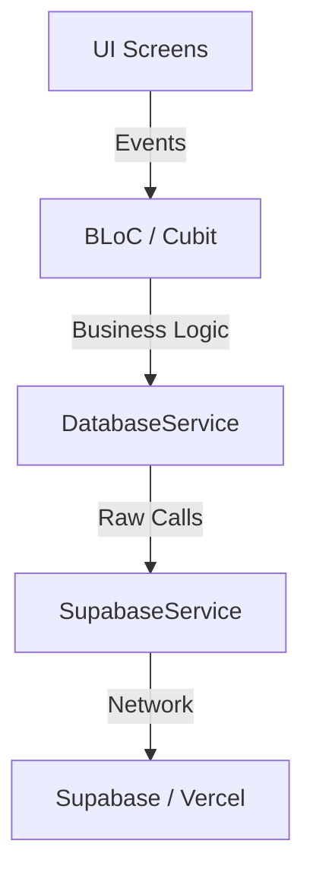

# Dependency Maps - LandyMaker

Understanding the critical relationships between LandyMaker's internal systems.

## 🌉 Global Infrastructure Bridge

## 🏗 Builder Workspace Chain

The chain of command for editing a page.

**`BuilderWorkspaceScreen`**
➡️ `LandingPageBuilderCubit` (State)
➡️ `BuilderCanvas` (Layout)
➡️ `SectionRenderer` (Loop)
➡️ `BlockRegistry` (Factory)
➡️ `CustomSectionWidget` (Render)

## 📄 Public Site Chain

The chain of command for rendering a live page.

**`PublicLandingPage`**
➡️ `TenantRoutingService` (Identifier)
➡️ `DatabaseService` (Fetch design_json)
➡️ `SectionRenderer` (Render)
➡️ `ActionHandlerService` (Interactions)
➡️ `PixelEventService` (Tracking)

## 🛡️ Secure Lead Chain

The strict mandatory flow for form data.

**`CustomLeadFormWidget`**
➡️ `ValidationEngine` (Schema check)
➡️ `TurnstileService` (Captcha token)
➡️ `DatabaseService.submitLead` (Proxy)
➡️ `Supabase Edge Function` (Backend verify)
➡️ `Supabase Table` (Final insert)

## 🌍 SEO & Blog Chain

**`Vercel Edge`**
➡️ `middleware.js` (Interceptor)
➡️ `Supabase REST` (Metadata)
➡️ `landymaker-blog` (Next.js proxy)
➡️ `robots.txt / sitemap.xml` (Auto-gen)
