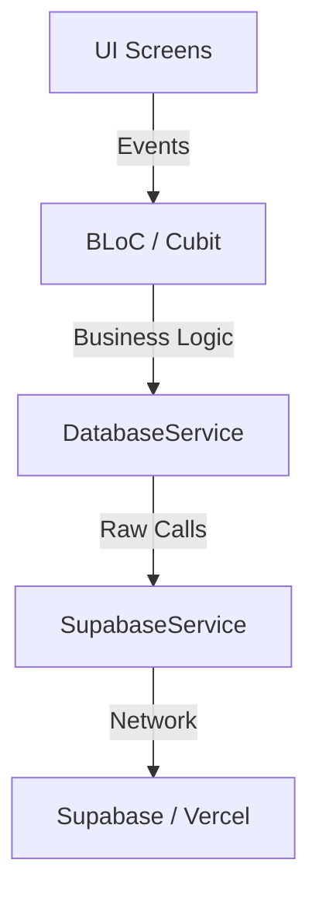
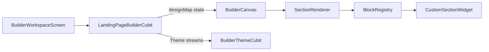
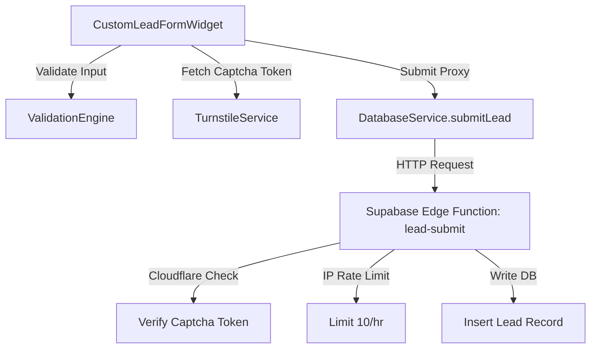
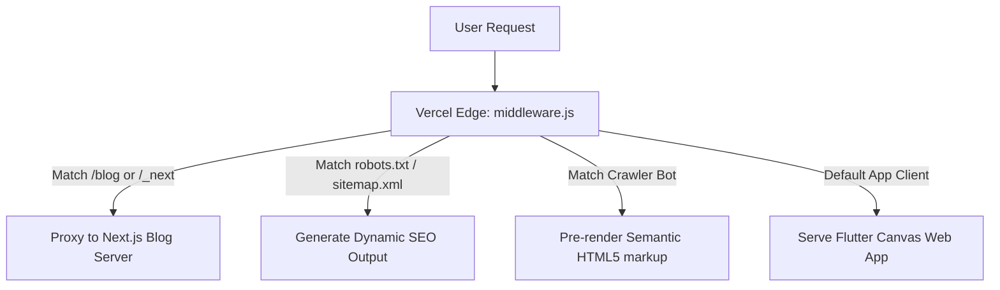

# LandyMaker Unified System Map & Architecture Index

This document is the unified map of LandyMaker's codebase. It consolidates directories, feature areas, screens, routes, services, and system dependency flows into a single, high-density reference file.

---

## 📂 1. Directory Structure & Layout

```text
/
├── api/                    # Vercel Serverless Functions (JS/Node)
├── assets/                 # Global assets (images, logos)
├── blog-frontend/          # Next.js 16 Blog Application (Headless)
├── docs/                   # Platform documentation
│   └── ai/                 # AI-specific navigation & guidebooks
├── lib/                    # Main Flutter Application Source
│   ├── core/               # Shared logic, theme, routing, and generic widgets
│   │   ├── constants/      # App constants
│   │   ├── forms/          # Validation Engine and Field Renderer
│   │   ├── localization/   # Translation dictionaries (ar/en)
│   │   ├── responsive/     # Layout breakpoints and responsive builder widgets
│   │   ├── router/         # GoRouter routing rules (app_router.dart)
│   │   ├── services/       # Low-level core services (Analytics, Turnstile)
│   │   ├── theme/          # Styles, palettes, and light/dark theme schemes
│   │   ├── utils/          # Utility helpers
│   │   └── widgets/        # Generic shared UI atoms/molecules
│   ├── features/           # Domain-driven feature modules (The "Meat" of the app)
│   │   ├── auth/           # Login, Register, Password Reset
│   │   ├── blog_admin/     # Admin interface for managing the headless blog
│   │   ├── builder/        # Editor workspace, block property editors, registries
│   │   ├── dashboard/      # User management shell, analytics, leads tracker, domain setup
│   │   ├── home/           # SaaS marketing website, template picker
│   │   ├── public_viewer/  # High-performance renderer for live landing pages
│   │   ├── subscription/   # Tier limits, upgrade prompts, payment UI
│   │   └── super_admin/    # Platform-level metrics and global configuration
│   ├── services/           # Global singleton services (Supabase, Auth, etc.)
│   └── main.dart           # App Entry Point
├── supabase/               # Backend-as-a-Service configuration
│   ├── functions/          # Deno Edge Functions
│   └── migrations/         # SQL Schema and RLS Policies
├── web/                    # Flutter Web-specific build artifacts & SEO files
├── AI_CONTEXT.md           # Core project memory & rules (Single Source of Truth)
└── middleware.js           # Vercel Edge Middleware (SEO, Routing, Bot Detection)
```

---

## 🏗️ 2. Business Feature Directory

Locate platform functionality by business purpose rather than exact filename.

| Feature Name | Business Purpose | Main Entry / Screen | Main Controller | Main Widgets / Assets |
| :--- | :--- | :--- | :--- | :--- |
| **Builder** | Drag-and-drop editor workspace | `BuilderWorkspaceScreen` | `LandingPageBuilderCubit` | `BuilderCanvas`, `BuilderSidebar` |
| **Public Viewer** | Rendering live landing pages | `PublicLandingPage` | `PublicPageCubit` | `SectionRenderer` |
| **Analytics** | High-fidelity visitor metrics | `AnalyticsScreen` | `LeadsAnalyticsCubit` | `DataCard`, `PageStatCard` |
| **Leads** | Lead management and submission | `LeadsTrackerScreen` | N/A (Direct DB fetch) | `ResponsiveDataTable` |
| **Auth** | User identity and access | `LoginScreen`, `RegisterScreen` | `AuthCubit` | `SocialSignInButton`, `AuthLayoutWrapper` |
| **Media Gallery** | Asset storage and management | `MediaGalleryScreen` | `MediaGalleryCubit` | `ImagePickerModal` |
| **SEO Settings** | Site-specific SEO configuration | `SeoSettingsModal` | N/A (Builder context) | `CustomTextField` |
| **Domains** | Custom domain configuration | `DomainSettingsScreen` | `ActiveWebsiteCubit` | `DomainSetupWidget` |
| **Super Admin** | Platform-level monitoring | `SuperAdminPanelScreen` | `SuperAdminCubit` | `ResponsiveDataTable` |
| **Blog Admin** | Headless blog management | `BlogManagementScreen` | `BlogCubit` | `BlogEditorScreen` |
| **Subscription** | Tier limits and payments | `UpgradeLimitModal` | N/A (Service layer) | `ManualPaymentModal` |
| **Sticky CTA** | High-conversion scroll overlay | N/A (Internal) | N/A (Local state) | `StickyCtaBar` |
| **Store Expansion** | Advanced commerce blocks & Cart 2.0 | N/A (Builder Sections) | `CartCubit` | `FeaturedProductWidget`, `BentoStoreWidget`, `FloatingCartWidget` |
| **Builder Theme** | Global design (colors, fonts, backgrounds) | N/A (Internal) | `BuilderThemeCubit` | `BuilderSidebar`, `BackgroundPickerTab` |
| **Draft / Publish** | Page lifecycle management | `BuilderWorkspaceScreen` | `LandingPageBuilderCubit` | `BuilderAppBar`, `BuilderOptionsModal` |
| **Analytics Overview**| Dashboard home stats + trend chart | `DashboardHomeScreen` | `LeadsAnalyticsCubit` | `AnalyticsOverviewWidget`, `DataCard` |
| **Notifications** | In-app and push notification system | `NotificationsScreen` | `NotificationCubit` | `NotificationInboxModal` |
| **Homepage Editor** | Super admin homepage sections management | `HomepageEditorScreen` | `HomepageEditorCubit` | `HomepageSectionCard`, `HeroConfigSheet` |
| **User Profile** | Super admin detailed user view | `UserProfileScreen` | `UserProfileCubit` | `StatusPill` |
| **Bulk Actions** | Super admin multi-select user operations | `SuperAdminPanelScreen` | `SuperAdminCubit` | `BulkActionBar` |

---

## 🖥️ 3. Screen & Page Index

Find screens based on their business description or path.

| Screen Purpose | File Path | Route | Feature |
| :--- | :--- | :--- | :--- |
| **Main Landing Page** | `lib/features/home/screens/landymaker_home_screen.dart` | `/` | Home |
| **Login Page** | `lib/features/auth/screens/login_screen.dart` | `/login` | Auth |
| **Register Page** | `lib/features/auth/screens/register_screen.dart` | `/register` | Auth |
| **Password Recovery** | `lib/features/auth/screens/forgot_password_screen.dart` | `/forgot-password` | Auth |
| **Reset Password** | `lib/features/auth/screens/reset_password_screen.dart` | `/reset-password` | Auth |
| **Main Editor Workspace**| `lib/features/builder/screens/builder_workspace_screen.dart` | `/builder/:pageId` | Builder |
| **User Dashboard Home** | `lib/features/dashboard/screens/dashboard_home_screen.dart` | `/dashboard` | Dashboard |
| **Analytics Dashboard** | `lib/features/dashboard/screens/analytics_screen.dart` | `/dashboard/analytics` | Dashboard |
| **Leads Management** | `lib/features/dashboard/screens/leads_tracker_screen.dart` | `/dashboard/leads` | Dashboard |
| **Media Library** | `lib/features/dashboard/screens/media_gallery_screen.dart` | `/dashboard/gallery` | Dashboard |
| **Domain Configuration** | `lib/features/dashboard/screens/domain_settings_screen.dart` | `/dashboard/domain` | Dashboard |
| **Product Feed Sync** | `lib/features/dashboard/screens/product_feed_screen.dart` | `/dashboard/feed` | Dashboard |
| **Template Library** | `lib/features/home/screens/template_picker_screen.dart` | `/templates` | Home |
| **Legal / Policy Page** | `lib/features/home/screens/legal_page.dart` | `/about`, `/privacy-policy`, `/terms` | Home |
| **Published Site View** | `lib/features/public_viewer/screens/public_landing_page.dart` | `/:pageName` (Catch-all) | Public Viewer |
| **Super Admin Panel** | `lib/features/super_admin/screens/super_admin_panel_screen.dart` | `/dashboard/super-admin` | Super Admin |
| **User Profile (Admin)** | `lib/features/super_admin/screens/user_profile_screen.dart` | `/dashboard/super-admin/users/:userId` | Super Admin |
| **Homepage Editor** | `lib/features/super_admin/screens/homepage_editor_screen.dart` | `/dashboard/homepage-editor` | Super Admin |
| **Platform SEO Editor** | `lib/features/super_admin/screens/platform_seo_screen.dart` | `/dashboard/platform-seo` | Super Admin |
| **Notifications** | `lib/features/dashboard/screens/notifications_screen.dart` | `/dashboard/notifications` | Dashboard |
| **Blog Management** | `lib/features/blog_admin/screens/blog_management_screen.dart` | `/dashboard/blog-admin` | Blog Admin |

---

## 📍 4. Application Routes & Guards

All routes are defined in `lib/core/router/app_router.dart` using `go_router`.

### Route Definitions
- `/` - Multi-mode entry (renders `LandyMakerHomeScreen` or `PublicLandingPage` based on tenant).
- `/login` / `/register` - Auth entryways.
- `/dashboard` - User dashboard shell (preserves state using `StatefulShellRoute.indexedStack`).
  - `/dashboard/analytics` - Visitor metrics.
  - `/dashboard/leads` - Lead capture table.
  - `/dashboard/gallery` - Media asset upload and library.
  - `/dashboard/domain` - Custom Domain setup.
  - `/dashboard/feed` - Product Feed syncing.
  - `/dashboard/notifications` - Alert log list.
  - `/dashboard/super-admin` - Super Admin panel (sub-tabs loaded via `?tab=users|plans|templates|broadcast|stats`).
  - `/dashboard/super-admin/users/:userId` - User Profile detail screen.
  - `/dashboard/homepage-editor` - Live homepage sections configuration.
  - `/dashboard/blog-admin` - Headless blog sync and admin.
  - `/dashboard/platform-seo` - Platform-wide static route SEO records.
- `/builder/:id` - Fullscreen canvas editor.
- `/templates` - Pre-designed template selector.
- `/:pageName` - Catch-all landing page viewer.

### Route Protection
- **Auth Guard**: Rejects unauthenticated visits to `/dashboard` or `/builder`, redirecting to `/login`.
- **Super Admin Guard**: Protects `/dashboard/super-admin` and sub-routes, verifying the user's role metadata is `super_admin`.
- **Tenant Resolution**: Built into `/` and `/:pageName`. `TenantRoutingService` intercepts execution at startup to check if the hostname matches a resolved custom domain or subdomain, redirecting to the viewer path.
- **Reserved Paths**: Any new static root paths (like `/templates`) **must** be declared in `TenantRoutingService.reservedPaths` to prevent tenant routing collisions.

---

## 📡 5. Services Directory

Global singleton services registered in `lib/injection_container.dart` via `GetIt` (aliased as `sl`).

| Service Name | Purpose | Key Methods | Dependencies |
| :--- | :--- | :--- | :--- |
| **SupabaseService** | Raw SDK database/auth client | `register`, `login`, `saveLandingPage` | `supabase_flutter` |
| **DatabaseService** | Structured database business queries | `getLandingPageById`, `submitLead` | `SupabaseService` |
| **AuthService** | Session management & Google OAuth | `signInWithGoogle`, `logout` | `SupabaseService` |
| **TenantRouting** | Path, subdomain, and domain resolver | `getRouteMode`, `getTenantIdentifier`| `dart:html` |
| **StorageService** | User asset upload and deletion | `uploadImage`, `deleteImage` | `SupabaseService` |
| **ImageMedia** | Pixabay stock images & ImgBB proxying | `fetchPixabayImages`, `proxyToImgBB` | `dio` |
| **Subscription** | Limits verification and tier checking | `getMaxPages`, `canAccessPremium` | `DatabaseService` |
| **ActionHandler** | Global link/scroll/WhatsApp executor | `executeAction`, `openWhatsApp` | `url_launcher` |
| **Turnstile** | Anti-spam Cloudflare widget builder | `registerViewFactory`, `getToken` | `dart:js` |
| **PixelEvent** | Analytics capture and submission | `trackPageView`, `trackLead` | `dart:js` |
| **FcmService** | Push notifications handler | `initialize`, `requestPermission` | `firebase_messaging` |
| **DynamicFont** | Dynamic Google Fonts downloader | `loadFont`, `loadFontsFromDesign` | `http`, `FontLoader` |

---

## 🌉 6. System Dependency & Flow Maps

### Global Infrastructure Bridge


### Builder Workspace Chain


### Secure Lead Capturing Pipeline


### SEO & Next.js Blog Proxy Precedence

