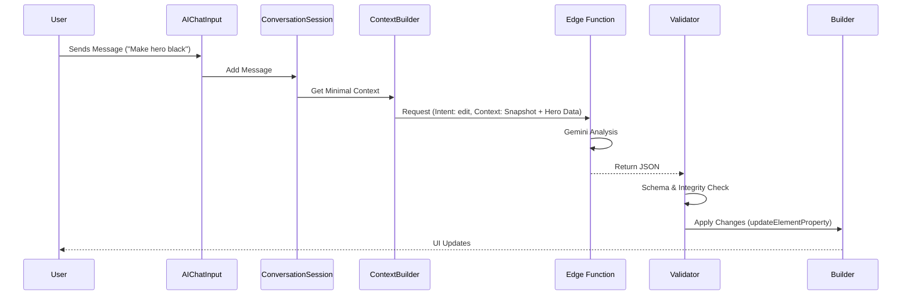

# Interactive AI Agent Architecture

This document defines the core architecture for the LandyMaker AI Agent.

## Intents

- **create**: Generate a new landing page or major section from scratch.
- **edit**: Modify existing sections (colors, text, variants).
- **pixabay_selection**: Triggered when the AI wants the user to pick an image manually.
- **ask_question**: AI asks for missing information (name, offer, etc.).
- **clarification**: User clarifies or provides missing details.

## States

- **Idle**: Ready for user input.
- **Listening**: User is typing or sending a message.
- **Thinking**: AI is analyzing the prompt and context.
- **WaitingForSelection**: Frontend is displaying the Pixabay selection grid.
- **Generating**: AI is generating the JSON payload.
- **ApplyingChanges**: Frontend is applying the received JSON to the builder.
- **Completed**: Task finished successfully.
- **Error**: Something went wrong.

## AI Message Flow

## Context Compression Architecture (Multi-Layer Memory)

### Layer 1 — Memory Summary
- **Storage**: Compressed summary of the business and user preferences.
- **Purpose**: Long-term memory across sessions.
- **Update Trigger**: Significant info change detected by AI.

### Layer 2 — Business Profile
- **Structure**: `{ business_name, industry, offer, target_audience, tone }`.
- **Purpose**: Fast lookup for generation templates.

### Layer 3 — Builder Snapshot
- **Structure**: `{ sections: [types], theme: {primary, background}, layout_style }`.
- **Purpose**: Informs AI of current page state without sending full JSON.

### Layer 4 — Recent Messages
- **Window**: Last 10 messages.
- **Purpose**: Short-term conversational context.

## Smart Context Selection Logic
Before each request, the system calculates the smallest payload needed:
1. If "Edit Hero", send only `hero` section data + Snapshot.
2. If "Create Page", send Business Profile + Memory Summary.
3. If "General Question", send only Memory Summary + Recent Messages.
